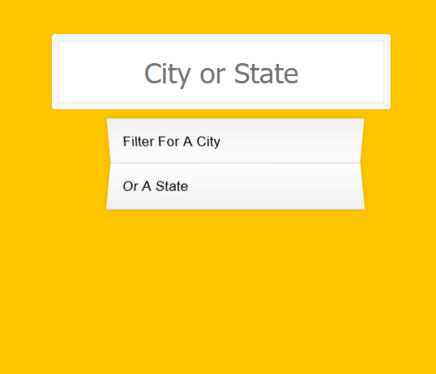
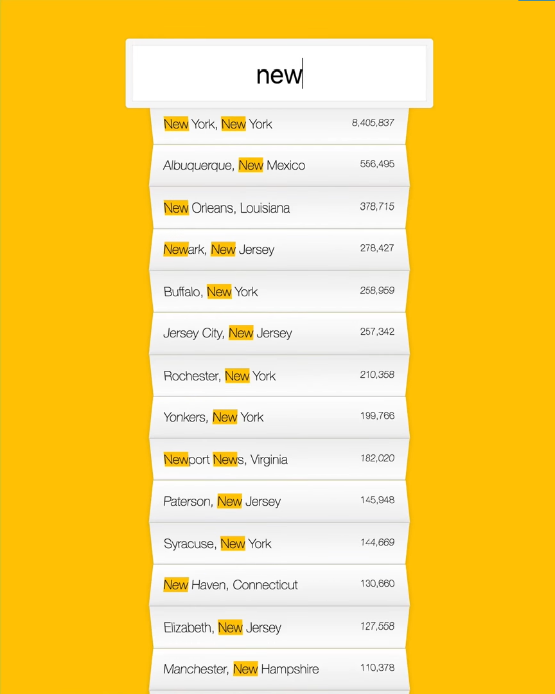

# JS-City-Search

<!-- Live link to deployed app -->

Repository: https://github.com/Mdudzik92/JS-City-Search  
Deployed app: https://mdudzik92.github.io/JS-City-Search/

<!-- Technologies used -->

HTML, CSS, JavaScript, RegEx, Fetch API, JSON

<!-- Explanation of what the app is -->

This is an app in which the user can search a city's population and discover all cities that include the letters they provide in the search bar.

<!-- Screenshot -->

<!-- License -->

MIT

<!-- Contact information -->

Email: mdudzik92@gmail.com
